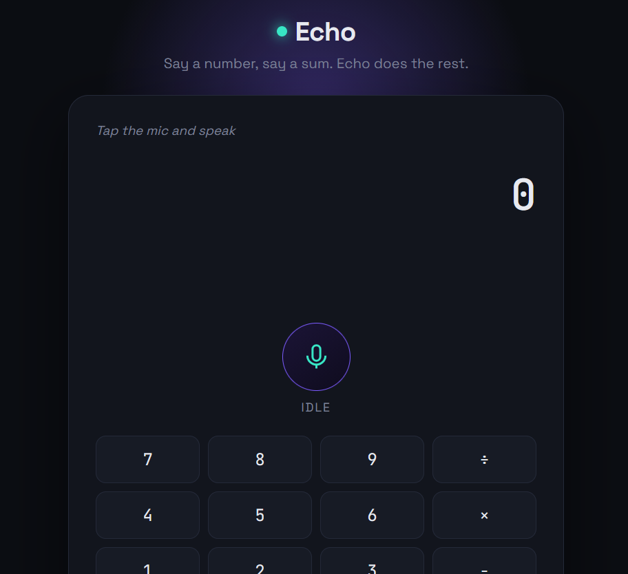

# Echo — Voice-Controlled Calculator & Assistant

A no-database, browser-only calculator you can talk to. Say a sum, a unit conversion, or a quick math question out loud — Echo transcribes it, computes the answer, speaks it back, and logs it. A manual keypad and typed-example chips are included as fallbacks for browsers/devices without microphone access.

## Features

- **Voice input** via the Web Speech API (`SpeechRecognition`) — no server, no third-party STT service
- **Voice output** via `SpeechSynthesis` — Echo reads the answer back to you
- **Live waveform visualization** while listening (real mic input via `AudioContext`/`AnalyserNode`, with an idle animated fallback)
- **Natural language parsing**:
  - Spoken numbers → digits ("twelve" → `12`, "one hundred" → `100`)
  - Spoken operators → symbols ("plus", "times", "divided by", "modulo", etc.)
  - Unit conversions: *"convert 5 kilometers to miles"*, *"10 kg to pounds"*, *"30 celsius to fahrenheit"*
  - Special functions: square root, squared, cubed, percentage of
- **On-screen keypad** for manual entry, and clickable example chips to try common phrases instantly
- **Command log** — a running history of the last 12 calculations understood
- **Distinctive dark UI** — glowing accent, pulsing mic button, monospace result display

## Tech Stack

- HTML5, CSS3 (Google Fonts: Space Grotesk + JetBrains Mono, no framework)
- Vanilla JavaScript (ES6+)
- **Web Speech API** — `SpeechRecognition` (input) and `SpeechSynthesisUtterance` (output)
- **Web Audio API** — `AudioContext` + `AnalyserNode` for the live waveform
- No database, no backend, no build step

## Project Structure

```
voice-calc/
├── index.html          # App shell: display, mic button, keypad, log, hints
├── css/
│   └── style.css        # Dark theme, glow effects, waveform + keypad styling
├── js/
│   ├── speech.js         # Wraps SpeechRecognition + SpeechSynthesis
│   ├── engine.js         # Parses spoken/typed text into calculations & conversions
│   └── app.js             # UI wiring: mic button, waveform draw loop, keypad, log
└── README.md
```

## Setup & Running

1. Download/clone this folder.
2. Serve it locally (required for microphone access in most browsers):
   ```bash
   cd voice-calc
   python -m http.server 8000
   ```
3. Open `http://localhost:8000` in **Chrome or Edge** (best `SpeechRecognition` support; Safari/Firefox support is limited or absent).
4. Click the mic button, allow microphone access when prompted, and speak a calculation.

## Example Phrases to Try

- "twelve plus seven"
- "fifty divided by five"
- "square root of eighty one"
- "convert 5 kilometers to miles"
- "what is 20 percent of 150"
- "10 kg to pounds"

## How It Works

1. **Listening**: `SpeechRecognition` captures your speech and streams interim + final transcripts.
2. **Visual feedback**: an `AnalyserNode` reads live microphone amplitude and draws it as a waveform on a `<canvas>`.
3. **Parsing** (`engine.js`):
   - Converts number-words to digits.
   - Checks for unit-conversion phrasing (`X unit to/in unit`) first.
   - Checks for special functions (square root, percent, squared/cubed).
   - Falls back to general arithmetic: converts remaining operator words to symbols and evaluates safely (only digits/operators are allowed through before evaluation).
4. **Output**: the result is displayed in a large monospace readout, spoken aloud via `SpeechSynthesis`, and added to the command log.

## Browser Support Notes

- `SpeechRecognition` is best supported in Chromium-based browsers (Chrome, Edge). It requires an internet connection since recognition runs via the browser vendor's cloud service.
- If the mic is unavailable or unsupported, the on-screen keypad and hint chips still let you calculate and hear results without voice input.
- Microphone access requires HTTPS or `localhost` — it will not work over a plain `file://` path in most browsers.

Screenshots


## Possible Extensions

- Multi-step conversation memory ("add 5 to that")
- More unit categories (volume, area, currency via a live-rate API)
- Wake-word activation ("Hey Echo…") instead of a manual mic button
- Light/dark theme toggle
- Export command log as CSV

## License

Free to use for academic/educational purposes.
